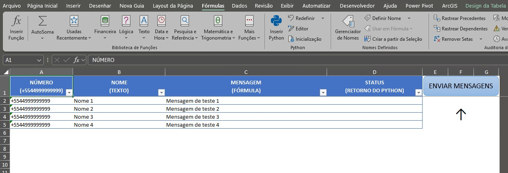

<h1 align="center">Telegram to Excel (telegram2excel)</h1> 

## Visão Geral
O `telegram2excel` é um projeto desenvolvido em Python para automatizar o envio de mensagens pelo Telegram, utilizando dados extraídos de um arquivo Excel. Além disso, o projeto pode ser empacotado como um executável standalone utilizando o `pyinstaller`.

## Funcionalidades
- Envio automatizado de mensagens para múltiplos contatos via Telegram.
- Empacotamento do servidor em um executável para facilitar a distribuição e uso.

## Tecnologias
<p align="center">
  
  
  
  
</p>

## Requisitos

Antes de iniciar, certifique-se de ter os seguintes requisitos instalados:

- Python 3.x
- `pip` para gerenciamento de pacotes
- Uma conta no Telegram
- Telegram API ID e Hash (obtidos no [site do Telegram](https://my.telegram.org/apps))

## Instalação

#### API Key & API Hash

0. Obtenha as credenciais da API do Telegram: Para usar o Telethon, você precisará do seu api_id e api_hash. Essas credenciais são fornecidas pelo Telegram após você registrar um aplicativo em https://my.telegram.org/apps (na seção API Development)​
TELETHON-01914.READTHEDOCS.IO
. Faça login com seu número de telefone no site e crie um novo aplicativo para receber um API ID e API Hash exclusivos.
    ```
        https://my.telegram.org/apps
    ```

1. Clone este repositório:
   ```sh
   git clone https://github.com/seuusuario/telegram2excel.git
   cd telegram2excel
   ```

2. Instale as dependências necessárias:
   ```sh
   py -m pip install -r requirements.txt
   ```

3. Configure as credenciais do Telegram no arquivo de enviroment (`.env`).
    ```
        API_ID={api_id}
        API_HASH={pi_hash}
    ```


## Uso

1. Prepare um arquivo Excel contendo os contatos e mensagens que deseja enviar.
2. Execute o script principal para iniciar o envio de mensagens:
   ```sh
   py -m src/server.py "+55(DDD)SEU-NÚMERO" "SUA MENSAGEM"
   ```
   A primeira execução do server.py o Telegram fará a verificação do número e código de segurança, que serão armazenadas em um arquivo de autenticação.

3. Para gerar um executável standalone, use o PyInstaller:
   ```sh
   pyinstaller --onefile --noconsole src/server.py
   ```
   O executável será gerado na pasta `dist/`.
   
   File: server.exe

## Excel

### Planilha Excel com VBA para envio das Mensagens


 - Número: +5544999999999;
 - Nome: Texto;
 - Mensagem: Texto ou fórmula;
 - Status: logs do servidor python (automáticos)


## Estrutura do Projeto
```
telegram2excel/
│-- src/
│   │-- server.py        # Script principal
│   │-- Modulo.vba       # Módulo de integração com Excel
│-- config.json          # Configurações do Telegram
│-- requirements.txt     # Dependências do projeto
│-- README.md            # Documentação do projeto
│-- TELEGRAM2.xlsm       # Executar o Projeto (EXCEL) ← ← ← ← ← ← ←
```

## Motivação
Automatizar processos manuais e demorados, otimizando a gestão do tempo e melhorando a operacionalidade das rotinas.

## Licença
Este projeto é distribuído sob a licença MIT. Veja o arquivo `LICENSE` para mais detalhes.
